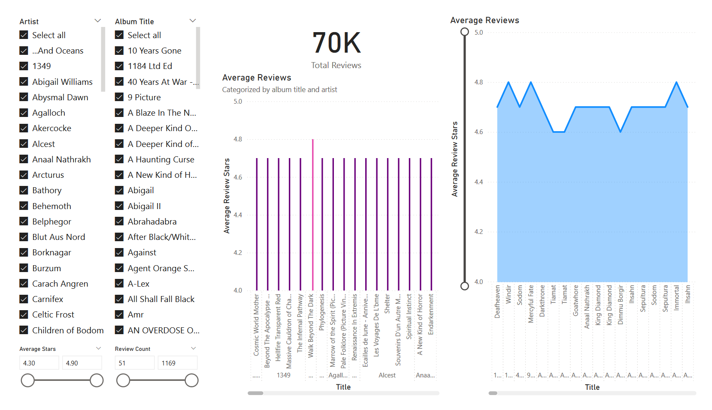
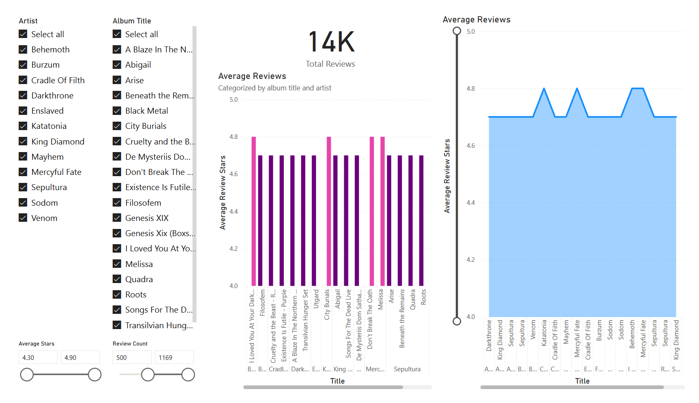
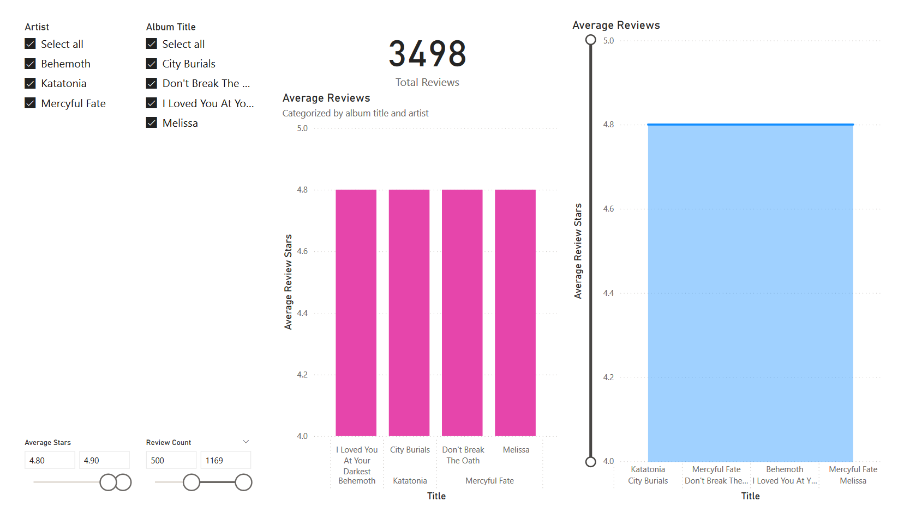
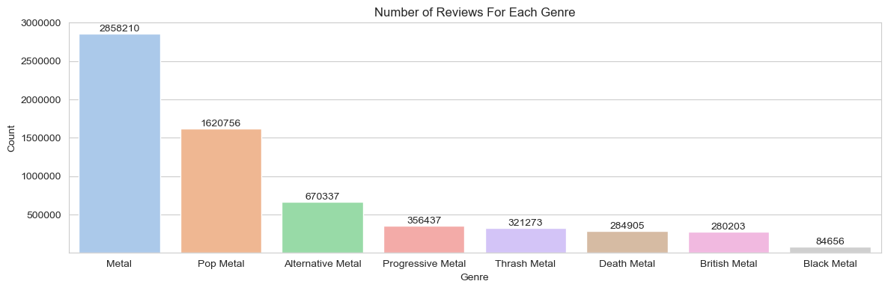
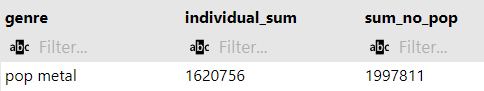

# Metal Music Analysis

I love metal music and I wanted to learn some more about how certain genres, years, and artists perform. I used various queries and analytical skills to transform and gain insights from the data.

[Dataset Used: Metal Music ratings and review counts from Amazon](https://www.kaggle.com/datasets/patkle/metal-music-ratings-and-review-counts-from-amazon/data)

Database created using [PostgreSQL](https://www.postgresql.org/)


[Cleaned Data](data/cleaned_data/all-metal-music-cleaned.csv)

# Processes & Analyses

*Each bullet point is a drop-down*

<details>
<summary><b>Data Cleaning</b></summary>

*There was a significant number of rows with insufficient data. Whether this be null values, or incompatible data types in certain columns due to (probable) issues with the web scraper used to collect the data.*

1. Add genre column to each dataset.
    - "thrash_and_speed_metal.csv" was shortened to thrash metal due to the terms being used interchangeably.
2. Append datasets with short [python script](working_files/append_csv.py). This was done to facilitate the cleaning process by removing cleaning step repetitions.

```
import pandas as pd
import os

# set path
csv_folder = 'working_data'

# list csv files
csv_files = [f for f in os.listdir(csv_folder) if f.endswith('.csv')]

# read and combine data
combined_data = pd.concat([
    pd.read_csv(os.path.join(csv_folder, file)) 
    for file in csv_files], ignore_index=True)

# save to new csv
output = 'metal-music.csv'
combined_data.to_csv(output, index=False)
```
3. Remove random data in columns that shouldn't be there (char in numeric columns). Likely a result of data scraper issues.
4. Create temporary database and remove all null values [Completed using created_metal_music_database.sql](working_files/create_metal_music_database.sql)
    - Cannot perform analysis with null due to every value in table needed.
5. Separate files by genre again (appended initially to make cleaning easier).
6. Final product of clean data found in [cleaned_data](data/cleaned_data/)
</details>

<details>
<summary><b>Black Metal Reviews Analysis</b></summary>

**Goal(s):**

*Query and visualize information about black metal reviews to see which artists and albums performed the best.*

*~~Check to see if certain time periods performed better (i.e. if older black metal is more popular than newer black metal). This question is from my personal favoritism for older black metal music, so I'm curious to see if the reviews on Amazon support my mindset.~~* **Not possible due to dates not being accurate in dataset. The 'year' is potentially the year they were added to Amazon.**

*Check to see if reviews were higher if physical media was purchased compared to MP3 files.*

1. Write query to get the average ratings per artist where there are more then 50 reviews. 
    - Limited to more than 50 reviews for analysis integrity to prevent a potential skew.
```
-- separate cte to query the average stars for every album released by artist
WITH average_ratings AS (
    SELECT
        artist,
        ROUND(AVG(star_rating), 1) AS average_stars
    FROM black_metal_music
    WHERE review_count > 50
    GROUP BY artist
)

-- join average_ratings and get basic information provided by dataset
SELECT
    b.artist,
    b.title,
    b.media,
    b.review_count,
    b.star_rating,
    a.average_stars
FROM average_ratings AS a
INNER JOIN black_metal_music AS b
    ON a.artist = b.artist
WHERE review_count > 50
ORDER BY b.artist;
```
2. Create a simple [dashboard](working_files/working_data/black_metal_reviews_analysis/black_metal_reviews_analysis.pbix) with the following features:
    - Slicers to allow the user to filter the data by band, album titles, range of review stars, and the count of reviews.
    - Graphs that showcase each band and their albums' performance. This was achieved with a simple column and stacked area chart.
        - The stacked area chart allows the user to adjust the range of values starting at 4.0 and ending at 5.0. This can further improve the user's experience when interacting with the dashboard.
    - Total count of reviews that automatically updates when a user filters the data with a respective slicer.
    


**To apply this dashboard, thinking of a scenario where it would be useful is essential.**

*Example scenario:*

Suppose I am an event planner and I am figuring out which bands I want to be at our concert. To do this, I can use the slicers in parallel with certain variables that would drive outreach, turnout, and overall performance of the event. To start off, a concert planner may want to look at reviews. The higher a band's average album reviews are, the higher quality the conert may be. However, one cannot blindly assume this is the only variable that matters. Keep in mind, this dashboard was created with a query that only showed the albums with a review count over 50. The lower the review count is, the easier it is for a rating to be unreliable. This was the mindset behind adding the review count slicer. 

Now back to the scenario. A concert planner can find reliable results by filtering the data using the slicers to determine high-rated bands with a large number of reviews on their albums. The more reviews, the more listeners. The more listeners, the more people that would potentially attend the live music event. 

Let's say the event planner wants to see all the bands that have albums with at least 500 reviews. This filters it down quite nicely and gives us a good list of bands that we can choose from.



However, there may be a potential issue. What if the event is only running for one day? And what if during that one day, there are only a few hours for the bands to perform? With that in mind, the concert planner could further filter the results by reviews. After checking the column charts for the highest-rated albums, the event planner can use the slicer to get a smaller list of bands that they could consider. 

The result of this filter gives us three bands with over 500 reviews and their albums with an average of 4.8 stars. This looks like it would be a pretty good concert that would draw a good number of people! With a bit of background knowledge, one would easily know that the bands listed are very large in the metal community. 



*Conclusion:*

With this dashboard, an event manager could easily figure out which bands in a specific genre would be the best to consider when planning. Filtering by certain variables streamlines the process and allows professionals make decisions based on the data, instead of guessing or using subjective reasoning. On top of all this, if a band did not want to perform, or no longer performs, the event manager could easily broaden the filter and get a new list that would still draw a large number of people to the event.
</details>

<details>
<summary><b>Genre & Band Analysis</b></summary>

**Goal(s):**

*Assume a similar scenario of a festival planner, shown above in the black metal music analysis.*

*Compare metal genres to one another.*

*Compare bands to one another.*

### Create a simple graph using seaborn to display the popularity of each genre's review count.

Created in [band_and_genre_analysis.ipynb](working_files/python/band_and_genre_analysis.ipynb)



While I did an analysis previously for black metal, my favorite genre, an event planner might not pick that genre if they were looking for a few bands to play. It's pretty easy to see what the fan favorites are. One thing to note, the "metal" genre column contains duplicates entries from other genres. This is due to it being an umbrella term, which every other genre falls into. However, even disregarding this, Pop Metal is still massive in comparison to the other genres.

To put it into perspective, take a look at the results from this query:

```
WITH all_but_pop AS (
    SELECT
        SUM(review_count) AS all_but
    FROM get_all_metal_music()
    WHERE genre NOT LIKE 'pop%metal'
)

SELECT
    genre,
    SUM(review_count) AS individual_sum,
    all_but_pop.all_but as sum_no_pop
FROM get_all_metal_music(), all_but_pop
GROUP BY genre, all_but_pop.all_but
ORDER BY individual_sum DESC;
```

This query will return the sum of all review counts for each genre, and then a sum of all the genres excluding pop metal.



This is **all** of the genres' review counts added up compared to the sum of the review counts of pop metal **alone**.

That's a ratio of approximately 16:20!

<details>
<summary>Exact Ratio</summary>
1620756 / 100000 = 16.20756
1997811 / 100000 = 19.97811
</details>


If you were a concert planner, which genre would you choose to drive the most revenue? While there could potentially be more factors to influence your choice, based on the numbers alone, pop metal is the clear winner and an almost must-pick.

</details>