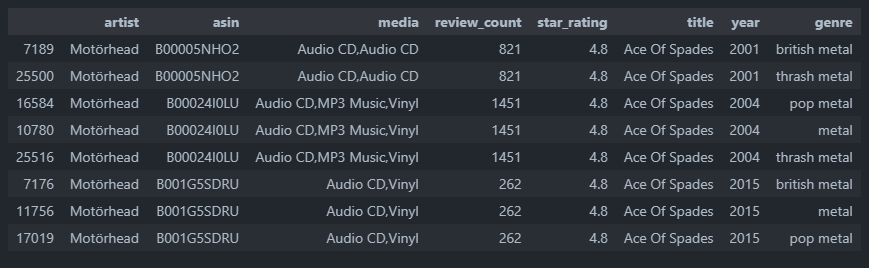

# Metal Music Analysis

I love metal music and I wanted to learn some more about how certain genres, years, and artists perform. I used various queries and analytical skills to transform and gain insights from the data.

[Dataset Used: Metal Music ratings and review counts from Amazon](https://www.kaggle.com/datasets/patkle/metal-music-ratings-and-review-counts-from-amazon/data)

Database created using [PostgreSQL](https://www.postgresql.org/)


[Cleaned Data](data/cleaned_data/all-metal-music-cleaned.csv)

Topics Covered:
- Database creation using PostgreSQL
- Data Cleaning
- Data Wrangling
- Data Mining
- Data Modeling
- Data Visualization
- Data Analysis
- Exploratory Data Analysis
- Quantitative Analytics

# Processes & Analyses

*Each bullet point is a drop-down*

<details>
<summary><b>SQL Functions<b></summary>

1. Create function to query all metal music from each dataset.
    - This function was created to prevent the need to make repetitious unions, and/or also prevent the need to upload an aggregated version of the dataset as a new table, which reduces the potential database size by half.

```sql
CREATE OR REPLACE FUNCTION get_all_metal_music()
RETURNS TABLE(
    artist TEXT,
    asin TEXT,
    media TEXT,
    review_count NUMERIC,
    star_rating NUMERIC,
    title TEXT,
    year INTEGER,
    genre TEXT
) AS $$
DECLARE -- initialize variables needed for function
    query TEXT := '';
    tbl RECORD;
    col RECORD;
    where_clause TEXT;
BEGIN
    -- loop over tables with "_metal_music" in the name to get all data
    -- this works because each metal genre has "_metal_music" as a suffix.
    FOR tbl IN
        SELECT 
            table_name
        FROM 
            information_schema.tables
        WHERE 
            table_schema = 'metal_music' AND table_name LIKE '%_metal_music'
    LOOP
        where_clause := '';
        
            -- null rows were found in the original function, which added nearly double the amount of rows.
            -- this was added after the fact to alleviate this issue.
        FOR col IN
            SELECT column_name
            FROM information_schema.columns
            WHERE table_name = tbl.table_name AND table_schema = 'metal_music'
        LOOP
            where_clause := where_clause || col.column_name || ' IS NOT NULL AND ';
        END LOOP;

        -- remove the last "AND"
        where_clause := left(where_clause, length(where_clause) - 4);

        -- construct the query for the current table
        query := query || 'SELECT * FROM ' || quote_ident(tbl.table_name) || ' WHERE ' || where_clause || ' UNION ALL ';
    END LOOP;

    -- Remove the last "UNION ALL" to make the query valid
    query := left(query, length(query) - 10);

    -- Execute the final query
    RETURN QUERY EXECUTE query;
END;
$$ LANGUAGE plpgsql;

```
</details>

<details>
<summary><b>Data Cleaning</b></summary>

*There was a significant number of rows with insufficient data. Whether this be null values, or incompatible data types in certain columns due to (probable) issues with the web scraper used to collect the data.*

1. Add genre column to each dataset.
    - "thrash_and_speed_metal.csv" was shortened to thrash metal due to the terms being used interchangeably.
2. Append datasets with short [python script](working_files/append_csv.py). This was done to facilitate the cleaning process by removing cleaning step repetitions.

```py
import pandas as pd
import os

# set path
csv_folder = 'working_data'

# list csv files
csv_files = [f for f in os.listdir(csv_folder) if f.endswith('.csv')]

# read and combine data
combined_data = pd.concat([
    pd.read_csv(os.path.join(csv_folder, file)) 
    for file in csv_files], ignore_index=True)

# save to new csv
output = 'metal-music.csv'
combined_data.to_csv(output, index=False)
```
3. Remove random data in columns that shouldn't be there (char in numeric columns). Likely a result of data scraper issues.
    - Carried out using Excel for the easy identification of data of types that did not fit the column(s).
4. Create temporary database and remove all null values [Completed using created_metal_music_database.sql](working_files/create_metal_music_database.sql)
    - Cannot perform analysis with null due to every value in table needed.
5. Separate files by genre again (appended initially to make cleaning easier).
6. Final product of clean data found in [cleaned_data](data/cleaned_data/)
</details>

<details>
<summary><b>Black Metal Reviews Analysis</b></summary>

**Goal(s):**

*Query and visualize information about black metal reviews to see which artists and albums performed the best.*

*~~Check to see if certain time periods performed better (i.e. if older black metal is more popular than newer black metal). This question is from my personal favoritism for older black metal music, so I'm curious to see if the reviews on Amazon support my mindset.~~* **Not possible due to dates not being accurate in dataset. The 'year' is potentially the year they were added to Amazon.**

*Check to see if reviews were higher if physical media was purchased compared to MP3 files.*

1. Write query to get the average ratings per artist where there are more then 50 reviews. 
    - Limited to more than 50 reviews for analysis integrity to prevent a potential skew.
```sql
-- separate cte to query the average stars for every album released by artist
WITH average_ratings AS (
    SELECT
        artist,
        ROUND(AVG(star_rating), 1) AS average_stars
    FROM black_metal_music
    WHERE review_count > 50
    GROUP BY artist
)

-- join average_ratings and get basic information provided by dataset
SELECT
    b.artist,
    b.title,
    b.media,
    b.review_count,
    b.star_rating,
    a.average_stars
FROM average_ratings AS a
INNER JOIN black_metal_music AS b
    ON a.artist = b.artist
WHERE review_count > 50
ORDER BY b.artist;
```
2. Create a simple [dashboard](working_files/working_data/black_metal_reviews_analysis/black_metal_reviews_analysis.pbix) with the following features:
    - Slicers to allow the user to filter the data by band, album titles, range of review stars, and the count of reviews.
    - Graphs that showcase each band and their albums' performance. This was achieved with a simple column and stacked area chart.
        - The stacked area chart allows the user to adjust the range of values starting at 4.0 and ending at 5.0. This can further improve the user's experience when interacting with the dashboard.
    - Total count of reviews that automatically updates when a user filters the data with a respective slicer.
    


**To apply this dashboard, thinking of a scenario where it would be useful is essential.**

*Example scenario:*

Suppose I am an event planner and I am figuring out which bands I want to be at our concert. To do this, I can use the slicers in parallel with certain variables that would drive outreach, turnout, and overall performance of the event. To start off, a concert planner may want to look at reviews. The higher a band's average album reviews are, the higher quality the conert may be. However, one cannot blindly assume this is the only variable that matters. Keep in mind, this dashboard was created with a query that only showed the albums with a review count over 50. The lower the review count is, the easier it is for a rating to be unreliable. This was the mindset behind adding the review count slicer. 

Now back to the scenario. A concert planner can find reliable results by filtering the data using the slicers to determine high-rated bands with a large number of reviews on their albums. The more reviews, the more listeners. The more listeners, the more people that would potentially attend the live music event. 

Let's say the event planner wants to see all the bands that have albums with at least 500 reviews. This filters it down quite nicely and gives us a good list of bands that we can choose from.


However, there may be a potential issue. What if the event is only running for one day? And what if during that one day, there are only a few hours for the bands to perform? With that in mind, the concert planner could further filter the results by reviews. After checking the column charts for the highest-rated albums, the event planner can use the slicer to get a smaller list of bands that they could consider. 

The result of this filter gives us three bands with over 500 reviews and their albums with an average of 4.8 stars. This looks like it would be a pretty good concert that would draw a good number of people! With a bit of background knowledge, one would easily know that the bands listed are very large in the metal community. 


*Conclusion:*

With this dashboard, an event manager could easily figure out which bands in a specific genre would be the best to consider when planning. Filtering by certain variables streamlines the process and allows professionals make decisions based on the data, instead of guessing or using subjective reasoning. On top of all this, if a band did not want to perform, or no longer performs, the event manager could easily broaden the filter and get a new list that would still draw a large number of people to the event.
</details>

<details>
<summary><b>Genre & Band Analysis</b></summary>

**Goal(s):**

*Assume a similar scenario of a festival planner, shown above in the black metal music analysis.*

*Compare metal genres to one another.*

*Compare bands to one another.*

## Create a simple graph using seaborn to display the popularity of each genre's review count.

Created in [band_and_genre_analysis.ipynb](working_files/python/band_and_genre_analysis.ipynb)


While I did an analysis previously for black metal, my favorite genre, an event planner might not pick that genre if they were looking for a few bands to play. It's pretty easy to see what the fan favorites are. One thing to note, the "metal" genre column contains duplicates entries from other genres. This is due to it being an umbrella term, which every other genre falls into. However, even disregarding this, Pop Metal is still massive in comparison to the other genres.

To put it into perspective, take a look at the results from this query:

```sql
WITH all_but_pop AS (
    SELECT
        SUM(review_count) AS all_but
    FROM get_all_metal_music()
    WHERE genre NOT LIKE 'pop%metal'
)

SELECT
    genre,
    SUM(review_count) AS individual_sum,
    all_but_pop.all_but as sum_no_pop
FROM get_all_metal_music(), all_but_pop
GROUP BY genre, all_but_pop.all_but
ORDER BY individual_sum DESC;
```

This query will return the sum of all review counts for each genre, and then a sum of all the genres excluding pop metal.


This is **all** of the genres' review counts added up compared to the sum of the review counts of pop metal **alone**.

That's a ratio of approximately 16 pop metal reviews for every 20 reviews for all the other genres combined!

<details>
<summary>Exact Ratio</summary>
16:20

1620756 / 100000 = 16.20756

1997811 / 100000 = 19.97811
</details>


If you were a concert planner, which genre would you choose to drive the most revenue? While there could potentially be more factors to influence your choice, based on the numbers alone, pop metal is the clear winner and an almost must-pick.

## Analyze Individual Bands and Discover More About the Dataset

Continued from previous section in [band_and_genre_analysis.ipynb](working_files/python/band_and_genre_analysis.ipynb)

First, I wanted to do a little bit of data exploration on the different bands, specifically how many rows each one showed up in.

To do this, I used the simple bit of code:

 ```py
 metal_df.artist.value_counts()
 ```


Simply looking at these numbers, it's safe to assume that the top few, especially Motorhead, Iron Maiden, and Deep Purple are unusually high. Let's do a more thorough investigation.

For this further investigation, I will choose Motorhead since it is the largest count that is not Various Artists. This is assuming Various Artists is a collaborative album, or some other form of media where one artist cannot be specified.

The next processes are the following:
1. Return the number of rows that Motorhead is found in.
2. Print the number of rows with unique titles.
3. Print the number of rows with duplicate titles, returning only the original value that is duplicated.
4. Display the duplicated rows in a data frame, ordered by the title.

```py
# get rows where artist is motorhead
motorhead = metal_df[metal_df.artist =='Motörhead']
print(motorhead.shape)

# get unique titles
unique_titles = motorhead.title.unique()
print("Unique titles:", len(unique_titles))

# get duplicated titles
duplicate_titles = motorhead[motorhead.title.duplicated()]
print("Duplicate titles:", len(duplicate_titles))

# display duplicate entries, ordered by title
duplicates = motorhead[motorhead.title.duplicated()]
duplicates.sort_values(by=['title'])
```


Simply looking at the above dataframe, we can see that "Ace Of Spades" has at least 5 rows. Let's print specifically that title and sort it by the year.

```py
duplicates[duplicates['title'] == "Ace Of Spades"].sort_values(by=['year'])
```



This gives us a look into the type of issues our dataset has. It includes re-releases of albums in different years, different genres, and with different media types.

Let's also look a the titles that have duplicates to find patterns.

```py
print(duplicates.title.unique())
```


Looking at this list, you can see that there are a lot of titles that you would know are not studio records, but instead are re-releases or live records.

Let's see how many rows we can remove that have these kinds of titles.

```py
# check if title contains the words indicating a secondary release, ignoring case to prevent inacurate data due to a poor title
motorhead_non_albums = motorhead[motorhead.title.str.contains("live|best|collection|alternate|archive|single|edition", case=False)]
print("Non-albums:", len(motorhead_non_albums))
```

**Returns:** 

Non-albums: 69

69 is a lot of extra entries that are in the dataset! Recall that there were 226 total rows, including duplicates. 

Let's see how low we can get the entries down to once we factor in all of these unclean traits.

```py
clean_titles_cnt = len(unique_titles) - len(motorhead_non_albums)
print("Total unique albums, not including alternate versions:", clean_titles_cnt)
```

**Returns:**

Total unique albums, not including alternate versions: 22

From these processes, we can conclude that Motörhead has rougly 22 unique studio albums on Amazon. 

With Motorhead cleaned, analysis on the review counts, average stars, and anything else can be much simpler with the irrelevant rows removed.
</details>

<details>
<summary><b>Dashboards</b></summary>

**Goal(s):**

*Create meaningful dashboards to answer potentiall business problems.*

*Create interactive dashboards, allowing a user to slice data and gain the insights they need.*

## Getting the Data

Using methods from the previous section, I can create a small Python file that will remove duplicates, and remove rows that are likely not studio albums.

[get_studio_albums.py](working_files/python/get_studio_albums.py "get_studio_albums.py") uses a very simple process:

```py
# remove duplicates
metal_no_dupes = metal_df.drop_duplicates(subset=['title'])

# remove keywords that indicate a re-release or live record
metal_no_dupes_only_albums = metal_no_dupes[~metal_no_dupes.title.str.contains("live|best|collection|alternate|archive|single|edition", case=False)]

# save file
metal_no_dupes_only_albums.to_csv('studio_albums_only.csv', index=False)
```

This returns 16,760 rows. Keep in mind the original dataset is 27,611 rows. This shows that there are over 10,000 rows of data that potentially irrelevant. Also consider that the original, completely uncleaned (null rows, data using special characters, mismatched data types in rows, etc) dataset after appending was over 33,000 rows.

Now that the dataset is cleaned, I can move on to Power BI and create dashboards.

## Power BI Dashboard Creation


### Dashboard #1


This dashboard showcases the top 10 bands per genre based on their album count. It shows:
- Distribution of each band within each genre, showcasing the most popular.
- Relative size of each genre.
    - For example, look at alternative metal's size versus pop metal's size. Just looking at the axis for both.
    - However, I can see that the "Various Artists" artist is heavily skewing the graphs.


After filtering "Various Artists" out, we get a much more accurate representation of the individual, specified artists.
- Before Alternative Metal had the artist with the highest title count, but that has been taken by British Metal with the artist Deep Purple.
- We can also see that the axis changed for all genres. Before, "Various Artists" was bringing the average up significantly, but now we can see it is much more accurate.

There are some interesting things I would like to point out from these graphs.
- In the British Metal graph, Iron Maiden is quite far behind Deep Purple, but in the All Genres graph, it pulls ahead.
    - After a quick look into the numbers, Iron Maiden has 10 more albums than Deep Purple.
- In the Thrash Metal graph, we can gain some insights about the genre itself. With Metallica being significantly higher than any other band, we can attribute it to a very long career.
    - Generally, we can assume that most bands will release an album every couple years, this means that Metallica has been going for over 40 years! 
        - (Technically, as of November 2024, they would be over 50 years, but my estimate is on the lower side, factoring in non-studio albums)
- Additionally, we can see that there are other genres such as Black Metal and Pop Metal which have very similar counts for each band. 
    - These can be attributed to two factors: 
        - The popularity of the genre for Pop Metal, which would mean a similar situation to Metallica. Being successful will incentivize bands to create more albums, and with Pop Metal bands being very similar, we can expect many of them to be successful.
        - The age of the genre for Black Metal. Black Metal is a relatively new genre of metal, so most bands have been around for a similar amount of time. Furthermore, with the genre containing more underground music, it is safe to assume even newer bands have a larger number of albums due to the albums requiring less production.
- Some bands, such as Iron Maiden and Deep Purple have very high title counts. While they almost certainly do not have this number of albums, many of these titles could also be releases of singles. This drives the number up as we can see.

</details>